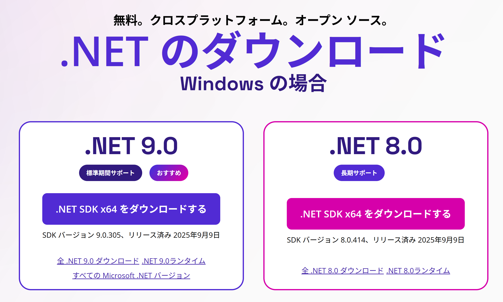
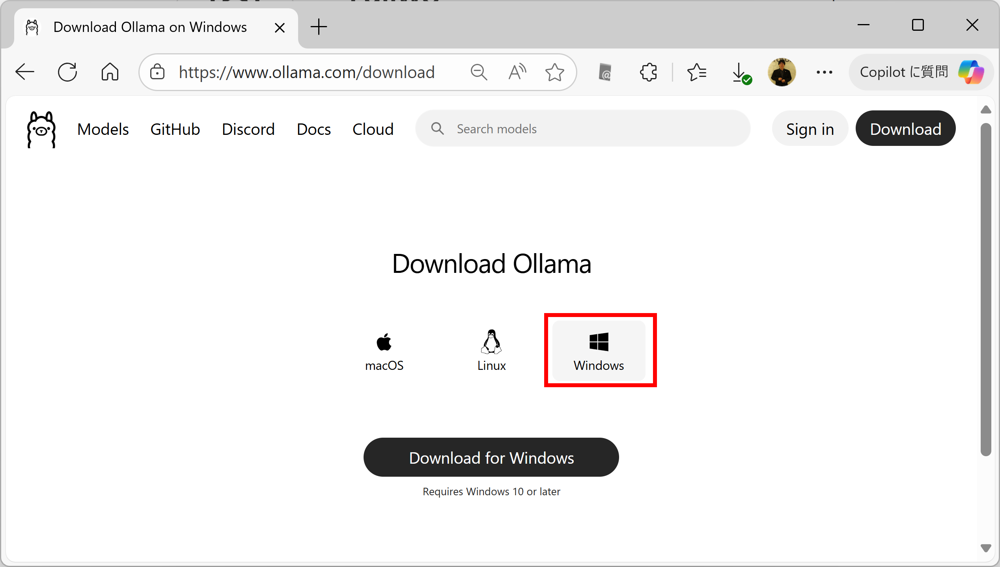
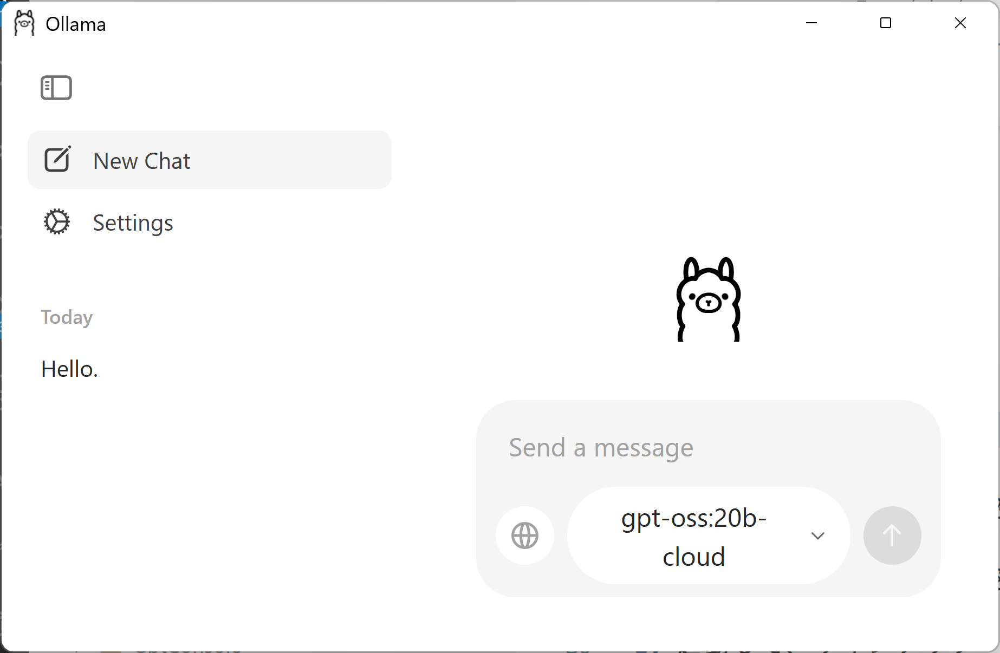
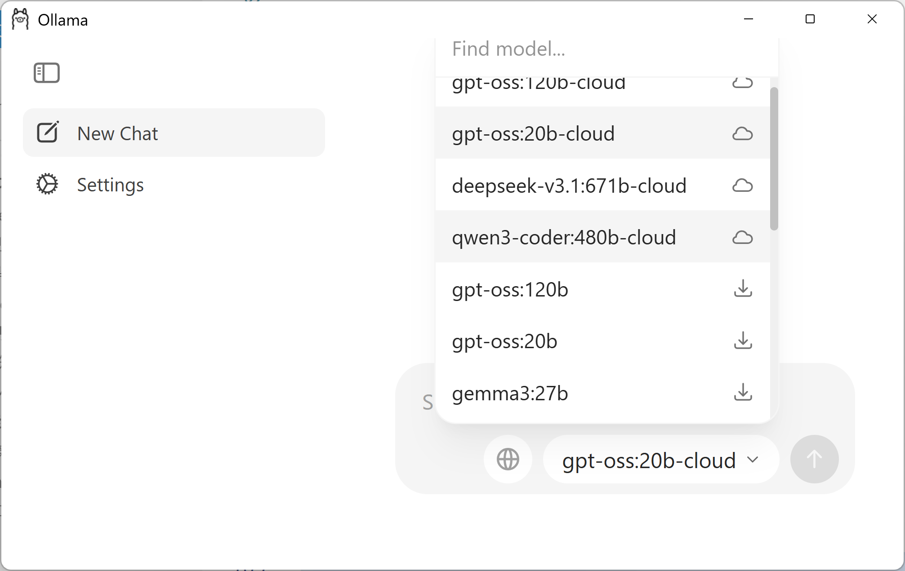

## 『AIエージェント開発ハンズオンセミナー』(開発者向け) チュートリアル

#### 開発環境

- Visual Studio と Visual Studio Code
  - なるべく最新のもの

### ■ 準備 - インストール


この手順では、チュートリアルのための準備として、必要なツールのインストールを行います。

#### 1\. \.NET

- 1\.1 \.NET のバージョンの確認

```console
dotnet --version
```
  8\.0以上であればOK

- 1\.2 (8\.0未満の場合) \.NET9\.0 のダウンロード



- 1\.3 (8\.0未満の場合) \.NET9\.0 のインストール


- 1\.4 \.NET のバージョンの再確認

```console
dotnet --version
```

実行例.
```console
10.0.100-rc.1.25451.107
```

#### 2\. Node.js の Windows 版をインストール

- 2\.1 Node.js のダウンロード

  - [Node\.js — Node\.js®をダウンロードする](https://nodejs.org/ja/download)


- 2\.2 Node.js のインストール


- 2\.2 確認

```console
node -v
```

実行例
```console
v24.1.0
```

```console
npm -v
```

実行例
```console
11.3.0
```

- 2\.3 npx のインストール

```console
npm install -g npx
```

- 2\.4 確認

```console
npx -v
```

実行例
```console
11.3.0
```

#### 3\. Ollama の Windows 版をインストール

- 3\.1 Ollama の Windows 版をダウンロード

  - [Ollama](https://www.ollama.com)



- 3\.2 Ollama をインストール


- 3\.3 起動して、サインアップ


- 3\.4 動作確認



- 3\.5 LLM の選択とダウンロード


