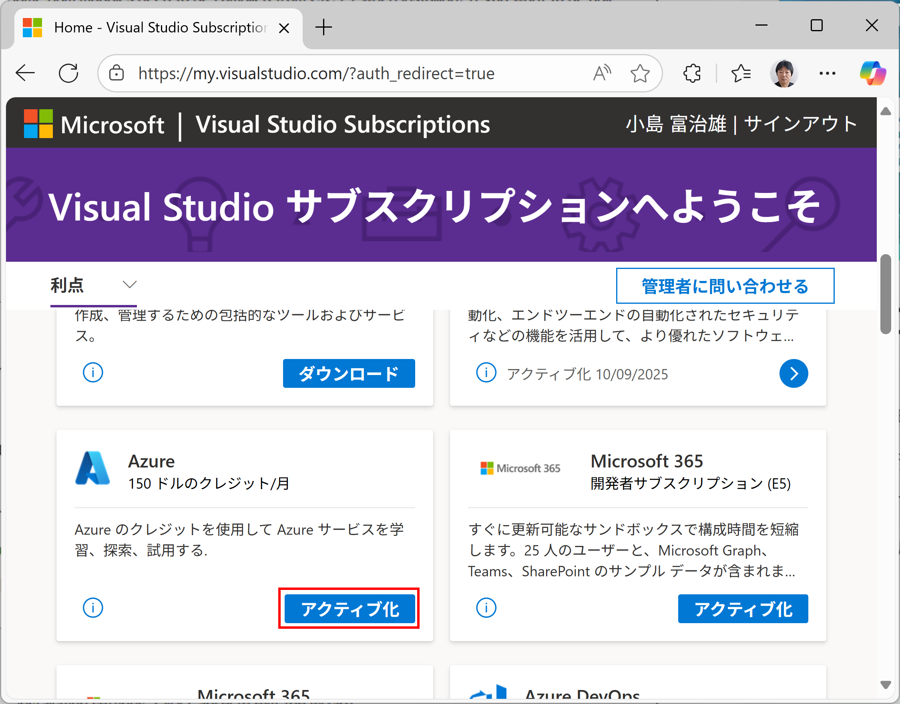
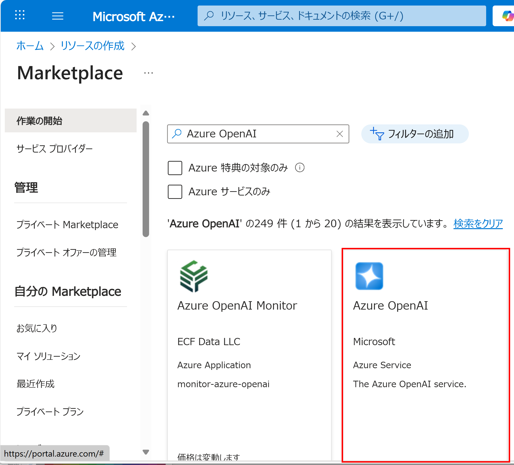
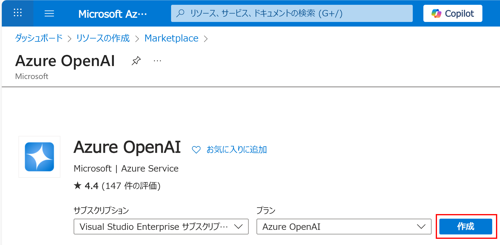
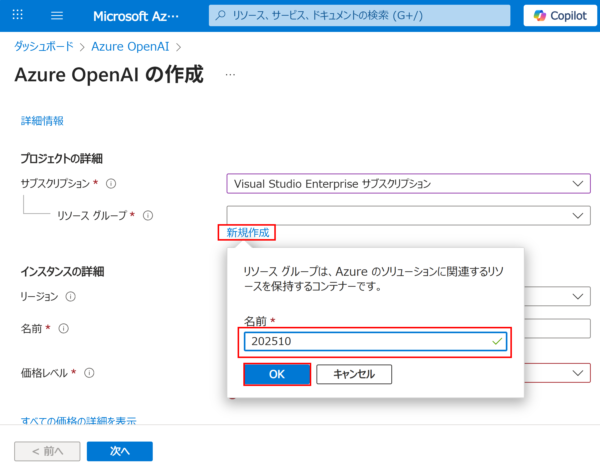
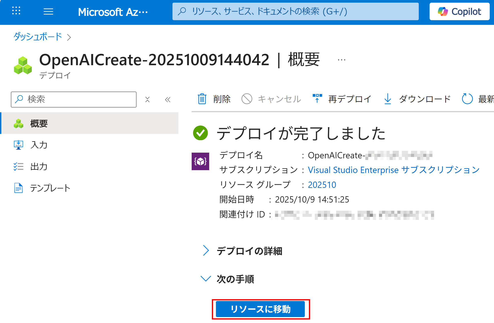
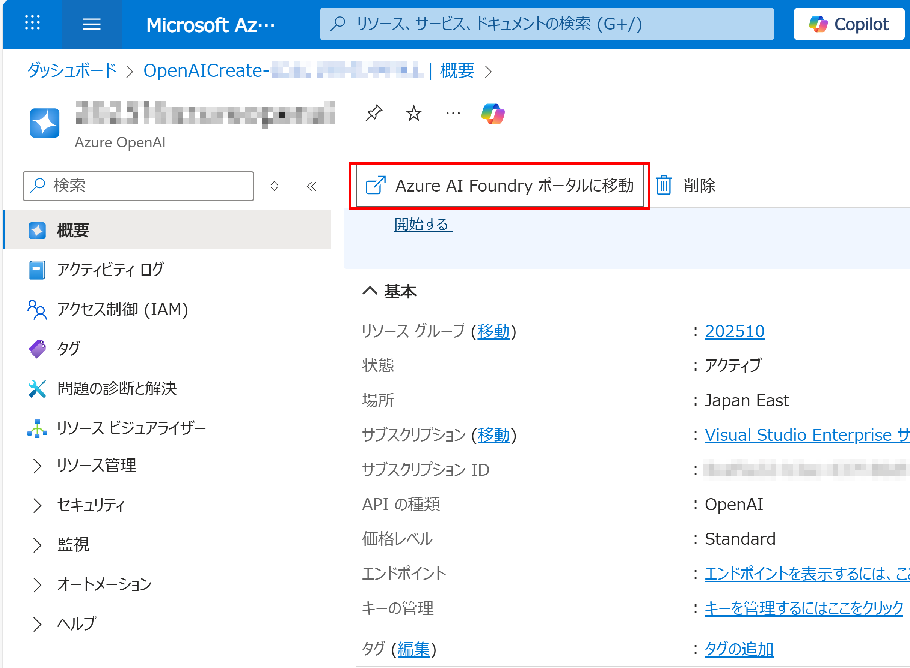
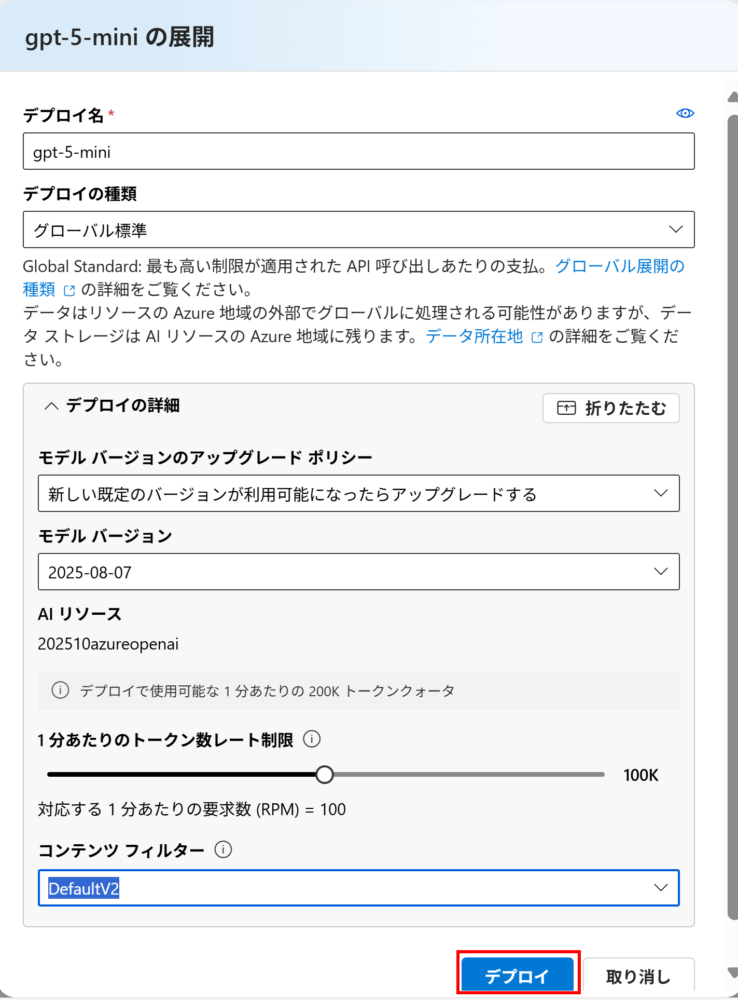

## 『AIエージェント開発ハンズオンセミナー』(開発者向け) チュートリアル

### ■ 準備 - Azure OpenAI

この手順では、チュートリアルのための準備として、Azure OpenAI による LLM を作成します。

#### 1\. Visual Studio Subscription の Azure 特典のアクティブ化

- [Visual Studio Subscriptions Portal](https://my.visualstudio.com)

#### 2\. Azure OpenAI で LLM を作成

- 2\.1 [Microsoft Azure Portal](https://portal.azure.com) へ行き、「リソースの作成」

- 2\.2 「Azure OpenAI」で検索し、「Azure OpenAI」をクリック

- 2\.3 「Azure OpenAI」を作成

リソース グループは新規作成する

下記のように入力し、「次へ」を3回クリック
※ 「202510azureopenai」の部分は、別のユニークな文字列とする
※ この文字列はメモ

「作成」

デプロイが終わったら、「リソースへ移動」

「Azure AI Foundry ポータルへ移動」

「APIキー」と「Azure OpenAI エンドポイント」をコピーしてメモ

「チャット」を選び、「デプロイの作成」

「gpt-5-mini」を選び、「確認」

「デプロイ」

