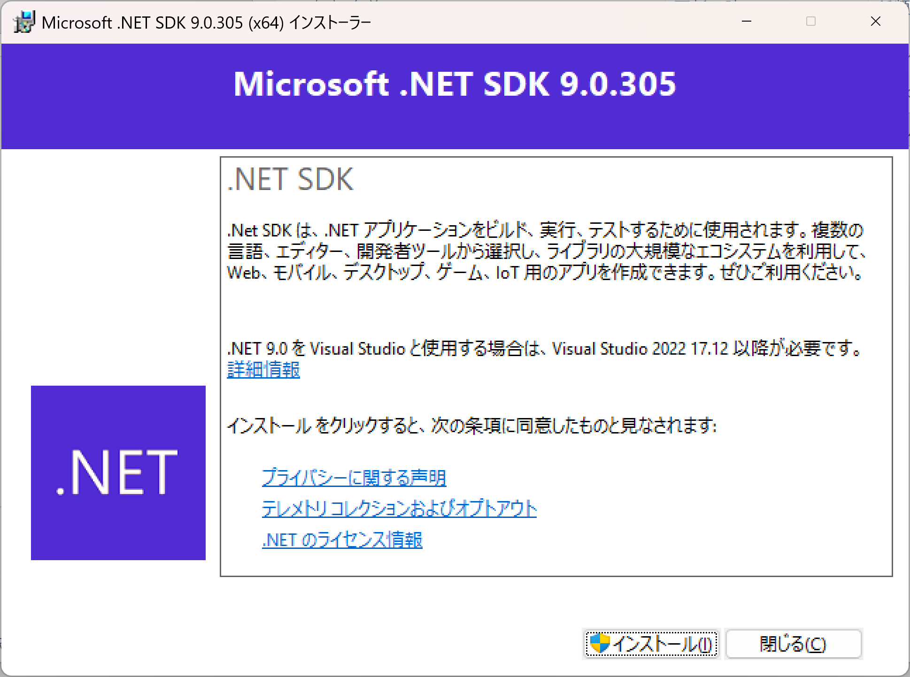
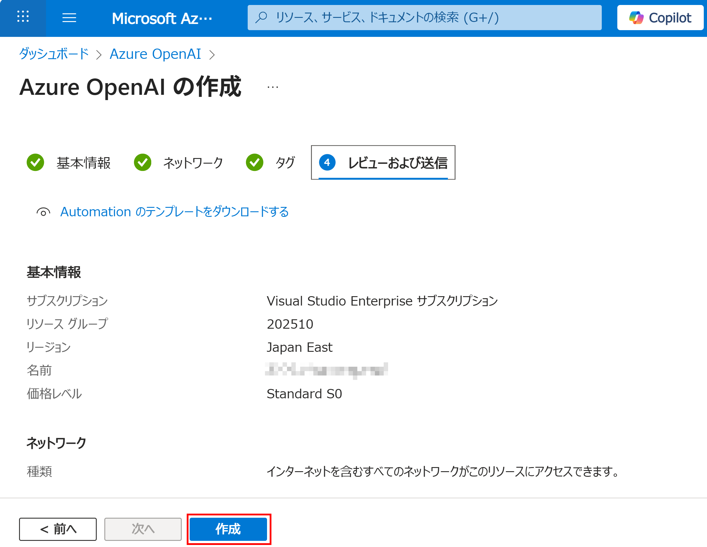
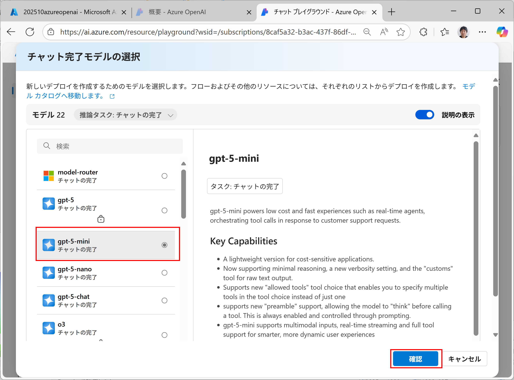

## 『AIエージェント開発ハンズオンセミナー』(開発者向け) チュートリアル

### ■ 準備

#### 1\. \.NET

- 1\.1 \.NET のバージョンの確認

```console
dotnet --version
```
  9\.0以上であればOK

- 1\.2 (9\.0未満の場合) \.NET9\.0 のダウンロード


- 1\.3 (9\.0未満の場合) \.NET9\.0 のインストール



- 1\.4 \.NET のバージョンの再確認

```console
dotnet --version
```

#### 2\. Node.js の Windows 版をインストール

- 2\.1 Node.js のダウンロード

  - [Node\.js — Node\.js®をダウンロードする](https://nodejs.org/ja/download)


- 2\.2 Node.js のインストール


- 2\.2 確認

```console
node -v
```

```console
npm -v
```

- 2\.3 npx のインストール

```console
npm install -g npx
```

- 2\.4 確認

```console
npx -v
```

#### 3\. Ollama の Windows 版をインストール

- 3\.1 Ollama の Windows 版をダウンロード

  - [Ollama](https://www.ollama.com)


- 3\.2 Ollama をインストール


- 3\.3 起動して、サインアップ


- 3\.4 動作確認


### ■ Azure OpenAI の準備

#### 1\. Visual Studio Subscription の Azure 特典のアクティブ化

- [Visual Studio Subscriptions Portal](https://my.visualstudio.com)


#### 2\. Azure OpenAI で LLM を作成

- 2\.1 [Microsoft Azure Portal](https://portal.azure.com) へ行き、「リソースの作成」


- 2\.2 「Azure OpenAI」で検索し、「Azure OpenAI」をクリック


- 2\.3 「Azure OpenAI」を作成


リソース グループは新規作成する


下記のように入力し、「次へ」を3回クリック
※ 「202510azureopenai」の部分は、別のユニークな文字列とする
※ この文字列はメモ


「作成」



デプロイが終わったら、「リソースへ移動」


「Azure AI Foundry ポータルへ移動」


「APIキー」と「Azure OpenAI エンドポイント」をコピーしてメモ


「チャット」を選び、「デプロイの作成」


「gpt-5-mini」を選び、「確認」



「デプロイ」


