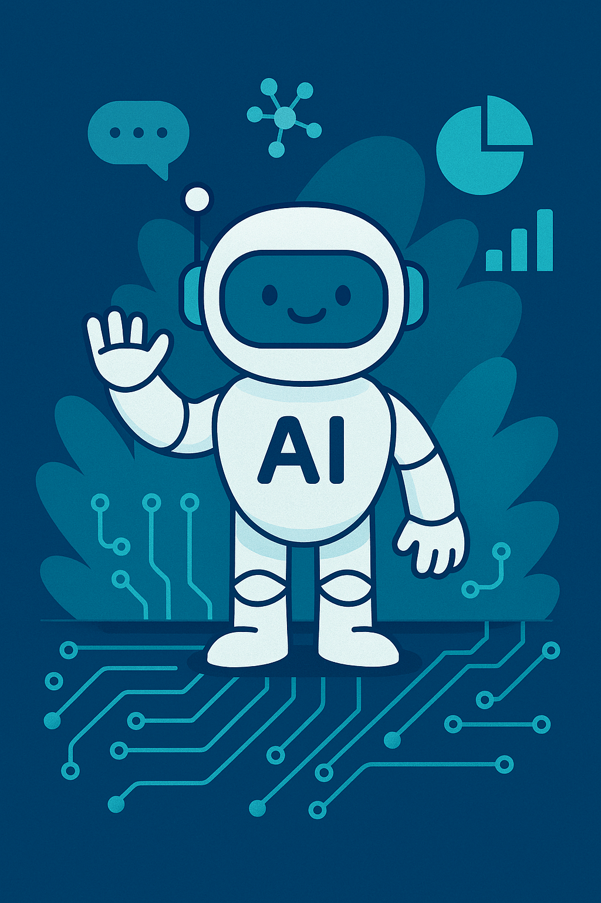

## 『AIエージェント開発ハンズオンセミナー』(開発者向け) チュートリアル

>このチュートリアルは執筆時点のプレビュー版の Microsoft Agent Framework が基になっています。
>Microsoft Agent Framework は、今後のバージョンアップで内容が変わる可能性があります。

- 0\. 準備
  - 0\.1 [インストール](./tutorial.0.0.md)
	- .NET、Node.js、Ollama のセットアップ
  - 0\.2 [Azure OpenAI](./tutorial.0.1.md)
	- Azure OpenAI の設定
- 1\. AIエージェントの作成 (LLM利用)
  - 1\.1 [ローカルLLMの利用](./tutorial.1.1.md)
	- Ollama を使った AI エージェントの作成
  - 1\.2 [Azure OpenAIの利用](./tutorial.1.2.md)
	- Azure OpenAI を使った AI エージェントの作成
  - 1\.3 [複数ターンのチャット](./tutorial.1.3.md)
	- 会話履歴を保持したチャット機能の実装
- 2\. MCP サーバーの作成
  - 2\.1 [MCP サーバー (STDIO) の作成](./tutorial.2.1.md)
	- 標準入出力を使った MCP サーバーの実装
  - 2\.2 [MCP サーバー (SSE) の作成](./tutorial.2.2.md)
	- Server-Sent Events を使った MCP サーバーの実装
  - 2\.3 [MCP サーバーの動作確認](./tutorial.2.3.md)
	- MCP サーバーの動作確認手順
- 3\. AIエージェントでの MCP サーバーの利用
  - 3\.1 [MCP サーバーの利用 (単数)](./tutorial.3.1.md)
	- 単一の MCP サーバーとの連携
  - 3\.2 [MCP サーバーの利用 (複数)](./tutorial.3.1.md)
	- 複数の MCP サーバーとの連携
