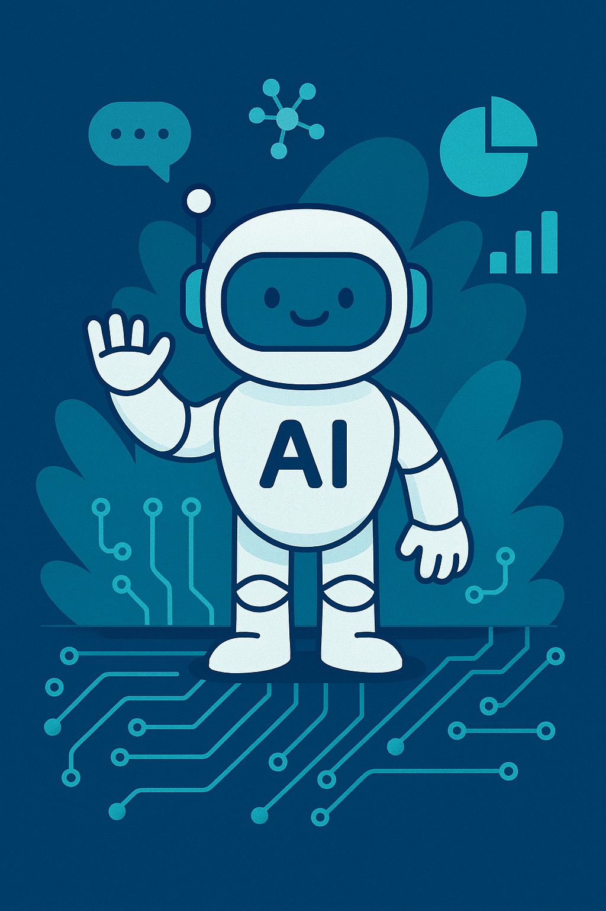

## 『AIエージェント開発ハンズオンセミナー』(開発者向け) チュートリアル

>このチュートリアルは執筆時点のプレビュー版の Microsoft Agent Framework が基になっています。
>Microsoft Agent Framework は、今後のバージョンアップで内容が変わる可能性があります。

## このチュートリアルについて

このチュートリアルでは、Microsoft Agent Framework と Model Context Protocol (MCP) を使用した AI エージェント開発を、段階的に学習できます。
各ステップは前のステップの知識を前提としているため、**順番に進めることを強く推奨**します。

## 学習の進め方

1. **準備編**から始めて、必要なツールをインストール
2. **基礎編**で AI エージェントの基本を理解
3. **MCP サーバー編**で外部ツールとの連携を学習
4. **応用編**で実践的なスキルを習得
5. **後片付け**で Azure リソースをクリーンアップ

各チュートリアルには、コード例、実行結果、スクリーンショットが含まれており、手順に従って進めることで実際に動作するサンプルを作成できます。

## チュートリアル一覧

### 0. 準備
  - 0\.1 [インストール](./tutorial.0.1.md)
	- .NET、Node.js、Ollama のセットアップ
  - 0\.2 [Azure OpenAI](./tutorial.0.2.md)
	- Azure OpenAI の設定
### 1. AIエージェントの作成 (LLM利用)
  - 1\.1 [ローカルLLMの利用](./tutorial.1.1.md)
	- Ollama を使った AI エージェントの作成
  - 1\.2 [Azure OpenAIの利用](./tutorial.1.2.md)
	- Azure OpenAI を使った AI エージェントの作成
  - 1\.3 [複数ターンのチャット](./tutorial.1.3.md)
	- 会話履歴を保持したチャット機能の実装
### 2. MCP サーバーの作成
  - 2\.1 [MCP サーバー (STDIO) の作成](./tutorial.2.1.md)
	- 標準入出力を使った MCP サーバーの実装
  - 2\.2 [MCP サーバー (SSE) の作成](./tutorial.2.2.md)
	- Server-Sent Events を使った MCP サーバーの実装
  - 2\.3 [MCP サーバーの動作確認](./tutorial.2.3.md)
	- MCP サーバーの動作確認手順
### 3. AIエージェントでの MCP サーバーの利用
  - 3\.1 [MCP サーバーの利用 (単数)](./tutorial.3.1.md)
	- 単一の MCP サーバーとの連携
  - 3\.2 [MCP サーバーの利用 (複数)](./tutorial.3.2.md)
	- 複数の MCP サーバーとの連携
### 4. [後片付け](./tutorial.4.1.md)
  - Azure リソースのクリーンアップ

## その他のリソース

- [AI エージェント開発ログ](./aiagentlog.md) - MCP の仕組みを理解するための参考資料
- [セミナー資料 (PDF)](./2025010.AIエージェント開発ハンズオンセミナー.pdf) - 前提知識のための資料
- [リポジトリの README](../README.md) - プロジェクト全体の概要

## ヘルプとサポート

問題が発生した場合は、[リポジトリの README](../README.md) の「トラブルシューティング」セクションを参照してください。

